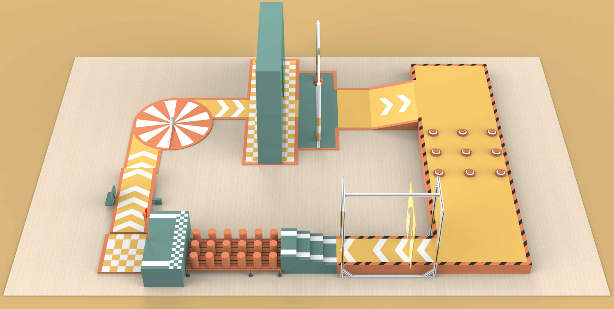
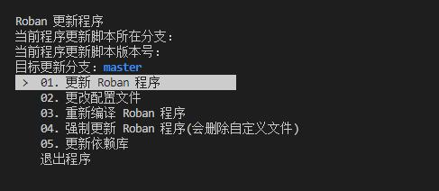
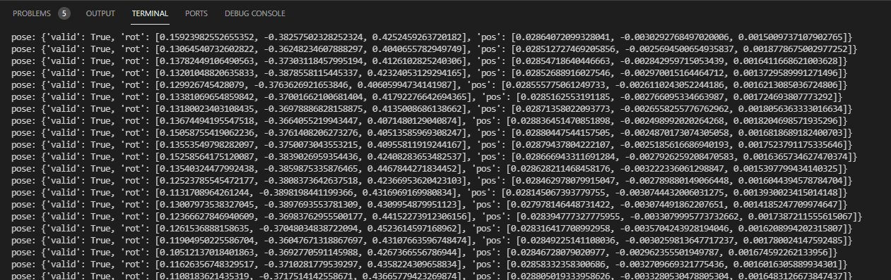
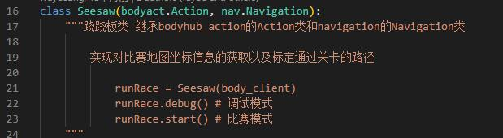
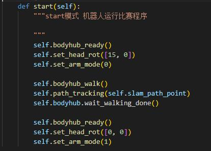
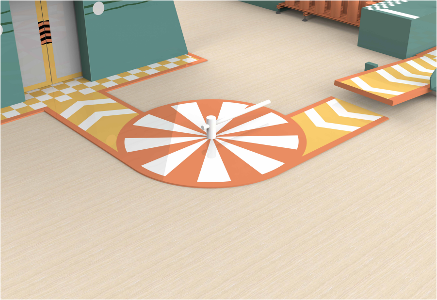
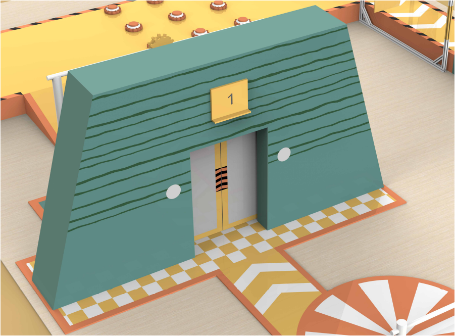
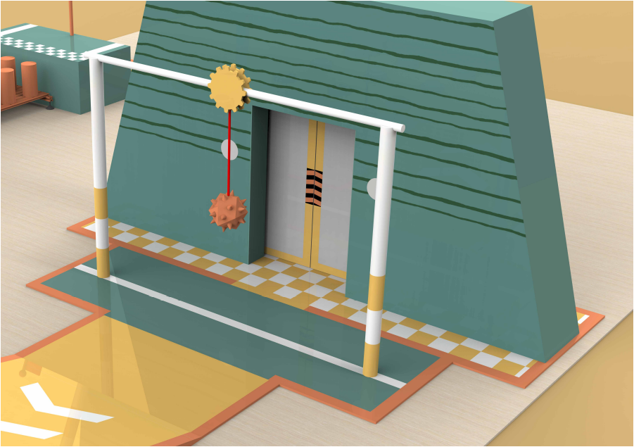
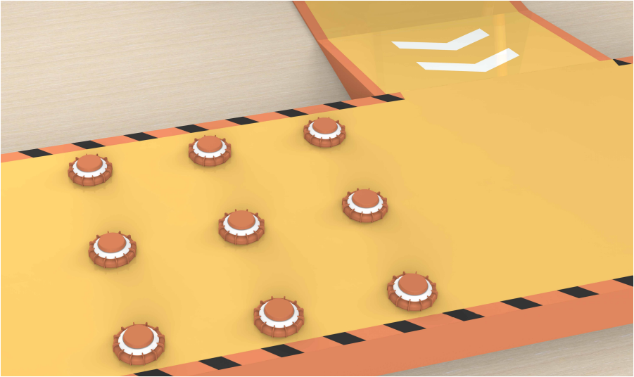
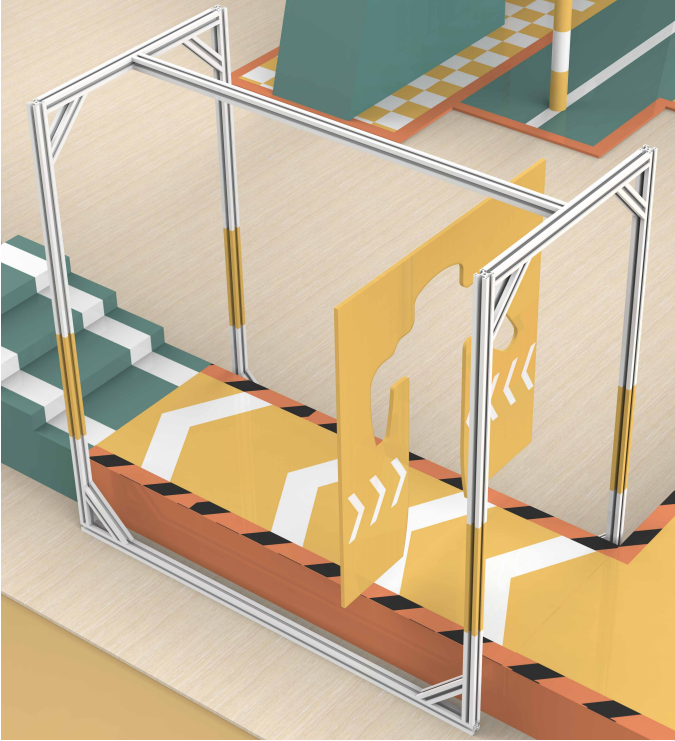

# Botec比赛示例程序运行流程

- 比赛地图

- 关卡设置
  - 比赛分为8个关卡
  1. 自由摆动跷跷板
  2. 永不停歇拦路索
  3. 察颜观色宝藏门
  4. 迎头重击摇摆锤
  5. 敏捷机动过障碍
  6. 千姿百态活动门
  7. 身手矫健上楼梯
  8. 身轻如燕梅花桩


### **示例程序获取**

- 机器人程序更新
  打开一个终端输入以下指令：

  ```shell
  sh -c "$(wget --no-cache http://roban.lejurobot.com/sys_update/download_sys_update.sh -O -)"
  ```
  

  出现这个界面选择:01更新roban程序或者04强制更新,等待更新完成即可.
  
- 子仓库拉取
  走楼梯、走梅花桩、走斜坡的示例程序和slam功能包在另外的仓库中，需要单独克隆并编译使用。
  执行`cd ~/robot_ros_application`，进入到`~/robot_ros_application`目录,检查子仓库的文件夹是否存在,对应执行以下操作:

  | | 不存在 | 存在 |
  |---|---|---|
  | footstair | $ git clone ssh://git@www.lejuhub.com:10026/Talos/footstair.git --recursive <br> \$ cd footstair && catkin_make | \$ cd footstair<br>\$ git checkout master<br>\$ git fetch<br>\$ git pull <br>\$ catkin_make|
  | pilewalk | $ git clone ssh://git@www.lejuhub.com:10026/hezhicheng/pilewalk.git --recursive <br> \$ cd pilewalk && catkin_make | \$ cd pilewal k<br>\$ git checkout master<br>\$ git fetch<br>\$ git pull <br>\$ catkin_make|
  | slam | $ git clone ssh://git@www.lejuhub.com:10026/sunhao/slam.git --recursive <br> \$ cd slam && catkin_make_isolated | \$ cd slam<br>\$ git checkout master<br>\$ git fetch<br>\$ git pull <br>\$ catkin_make_isolated |
  | slope | \$ git clone ssh://git@www.lejuhub.com:10026/hezhicheng/pilewalk.git --recursive slope <br> \$ cd slope/ <br> \$ git fetch <br> \$ git checkout slope  <br> \$ catkin_make |  \$ cd slope/ <br> \$ git fetch <br> \$ git checkout slope  <br> \$ catkin_make
  
> Tips: 在编译slam仓库过程中，'catkin_make_isolate'执行后可能会报错，重复执行一次'catkin_make_isolate'即可。

# 程序运行

关卡代码目录：
`/home/lemon/robot_ros_application/catkin_ws/src/ros_actions_node/scripts/botec/`

主要文件结构：
```shell
/home/lemon/robot_ros_application/catkin_ws/src/ros_actions_node/scripts/botec
├── bodyhub_action.py # 与bodyhub节点通信的接口，生成、发送动作轨迹的模块
├── navigation.py # 基于slam和artag导航模块
├── image_detect.py # 颜色识别类封装
├── image_manager.py # 用于获取各种图像的类封装
├── botec_main.py # 前三关连续运行的脚本
├── seesaw.py # 跷跷板关卡
├── turntable.py # 大转盘关卡
├── open_door.py # 开门关卡
├── pendulum_bob.py # 大摆锤关卡
├── minefield.py # 地雷阵关卡
├── pose_board.py # 姿态门关卡
├── to_pile.py # 梅花桩关卡前的往前走
├── chin_cam.launch # 运行下巴摄像头的launch文件
└── run_slam.sh # 运行slam的脚本
/home/lemon/robot_ros_application/footstair/ # 走楼梯示例代码程序
/home/lemon/robot_ros_application/pilewalk/ # 走梅花桩示例代码
/home/lemon/robot_ros_application/slope/ # 走斜坡示例代码
/home/lemon/robot_ros_application/slam/ # slam功能包
```

连续运行全部关卡脚本：

`bash /home/lemon/robot_ros_application/scripts/botec.sh`

整体概述：
- 运动控制：机器人的运动控制通过bodyhub节点实现，在lejulib模块的`motion.bodyhub_client`和`bodyhub_action.py`中对bodyhub节点的功能进行了python接口封装，比状态跳转、行走等。关于bodyhub节点的描述与使用可以参考`/home/lemon/robot_ros_application/catkin_ws/src/bodyhub/doc`目录下的使用文档。关于python封装的行走接口描述可以参考`/home/lemon/robot_ros_application/catkin_ws/src/ros_actions_node/scripts/botec/botec程序接口说明文档.md`。
- 位置获取：示例程序中机器人在关卡中的位置主要由Slam获得
  - slam位置获取
    - 使用slam需要先对比赛场地进行**建图**
      - 建图指令：
      - ```shell
        $ cd ~/robot_ros_application/slam/
        $ source devel_isolated/setup.bash
        $ rosrun SLAM RGBD utils/ORBvoc.bin utils/rgbd.yaml true false Slam_Map1
        # rosrun SLAM RGBD utils/ORBvoc.bin utils/rgbd.yaml <display> <reuse-map> <map-name>
        ```
      - 建图细节可以参考`/home/lemon/robot_ros_application/catkin_ws/src/ros_actions_node/scripts/game/2022/caai_roban_challenge/colleges/Readme.md`。根据需要可以使用一个地图，或者将比赛场地划分为多个区域进行建图。
    - 位置获取和标定
      - 在定位模式(上述指令最后的`reuse-map`改为`true`)下运行slam节点
      - 在机器人获取自身在地图中的位置之后，位置信息通过`/initialpose`主题发布，可以参考示例程序中的`navigation.py`的`SlamInfo`模块进行解析。
      - 新建一个终端运行：
        ```shell
        $ source ~/robot_ros_application/catkin_ws/devel/setup.bash
  
        $ rosrun ros_actions_node pose_board.py debug
        ```
        终端会不停刷新当前slam位置和姿态角

        
  
- 导航：示例程序中的`navigation.py`提供了基于slam位置的导航程序示例供参考
  - class SlamNavigation
    - path_tracking ： 机器人根据传入的位置点信息进行移动。

## 各个关卡思路参考
- 第一关：自由摆动跷跷板

    
  - 关卡思路参考：
  利用slam获得机器人的位置，确保机器人运行过程中不超出赛道，行走过程中降低机器人步幅防止在跷跷板上摔倒。

  - 示例代码目录：
  `/home/lemon/robot_ros_application/catkin_ws/src/ros_actions_node/scripts/botec/seesaw.py`

  - 示例代码中，Seesaw类继承自`bodyact.Action`和`nav.Navigation`获得路径规划和移动的函数能力

    

  - 主要流程在start中实现:
    
    - 首先跳转到ready状态，然后设置头部往下15°(这个和建图时头部角度有关，也可以不设置低头)
    - set_arm_mode(0)表示行走中手不动，防止机器人动作过大摔下跷跷板
    - 之后通过bodyhub_walk函数跳转到`walking`状态下允许行走
    - 之后调用path_tracking函数传入slam导航途径的点即可根据设定轨迹行走
    - 最后设置机器人跳转回ready状态。

- 第二关：永不停歇拦路索
  
    
  - 关卡思路参考：
    通过下巴摄像头图像识别出摆杆的位置，然后通过slam获得机器人定位，在某个时机让机器人按照固定轨迹规划走过该关卡即可。

  - 示例代码：
    `/home/lemon/robot_ros_application/catkin_ws/src/ros_actions_node/scripts/botec/turntable.py`
    示例代码中采用了颜色识别对转盘上的杆子进行识别
 

- 第三关：察颜观色宝藏门

    
 - 关卡思路参考：
   - 通过头部摄像头获取门上屏幕的图像，使用传统机器学习或者深度学习的方法获取对应的数字，然后走到对应的按钮前按下按钮打开门即可，按钮的位置可以由slam标定提前获知

 - 示例代码：
   - ```/home/lemon/robot_ros_application/catkin_ws/src/ros_actions_node/scripts/botec/open_door.py```
   - 示例代码运行：
      ```shell
      # 第1、2、3关代码运行
      cd ~/robot_ros_application/catkin_ws/
      . devel/setup.bash
      rosrun ros_actions_node botec_main.py
      ```

- 第四关：迎头重击摇摆锤

    
  - 关卡思路参考：
     - 通过头部摄像头识别摆锤的位置，在适当的时机往前移动即可通过

  - 示例代码：
   - `/home/lemon/robot_ros_application/catkin_ws/src/ros_actions_node/scripts/botec/pendulum_bob.py`
    示例代码中使用颜色识别对摆锤的位置进行识别。
   - 示例代码运行
      ```shell
      source ~/robot_ros_application/catkin_ws/devel/setup.bash
      rosrun ros_actions_node pendulum_bob.py
      ```

- 第五关：敏捷机动过障碍

    
  - 关卡思路参考：
    - 斜坡部分：首先需要规划好斜坡步态，让机器人走斜坡时免于摔倒
    - 地雷阵部分：可以利用slam规划一条通过区域的预设路线，或者动态识别地雷并躲避。
  - 示例代码：
    - 机器人走斜坡部分的步态规划代码位于:`/home/lemon/robot_ros_application/slope/`
    - 地雷阵代码位于：`/home/lemon/robot_ros_application/catkin_ws/src/ros_actions_node/scripts/botec/minefield.py`
  - 示例代码运行：
    - 走斜坡运行：
    - 运行之前需要将机器人的零点替换掉走斜坡程序仓库中的零点文件，即将`/home/lemon/.lejuconfig/offset.yaml`复制到`/home/lemon/robot_ros_application/slope/src/motion_interface/include/platform/roban/config/offset.yaml`文件中.
    - 随后打开终端执行
    - ```shell
      source ~/robot_ros_application/slope/devel/setup.bash
      rosrun ljhn_torcon ljhn_torcon_node
      ```
    - 过地雷阵运行：
    - ```shell
      source ~/robot_ros_application/catkin_ws/devel/setup.bash
      rosrun ros_actions_node minefield.py
      ```

- 第六关：千姿百态活动门

    
  - 关卡思路参考：
    - 通过通过机器学习或深度学习的方式识别出预设模板的动作，通过slam导航到通道中心位置，然后做出对应动作等待活动门通过后恢复站立并前进即可通关。
  - 示例代码运行：  
  - 场地中提供artag用于校正机器人做动作时的位置，可以参考示例程序中的`navigation.py`中的MarkerLocation模块获得artag位置对机器人位置进行标定和校正。
  - 通过以下指令打开artag标签识别节点
    ```shell
    source ~/robot_ros_application/catkin_ws/devel/setup.bash
    roslaunch ar_track_alvar roban_chin_camera.launch 
    ```
  - 然后运行关卡代码
  - ```shell
    source ~/robot_ros_application/catkin_ws/devel/setup.bash
    rosrun ros_actions_node pose_board.py
    ```

- 第七关：身手矫健上楼梯

    
  - 关卡思路参考：
    - 设计合理的上楼梯步态规划，通过slam导航到楼梯前执行即可
  - 示例代码
    - 走楼梯步态规划的示例代码位于子仓库`/home/lemon/robot_ros_application/footstair`中
    - 上楼梯的程序说明可以参考`/home/lemon/robot_ros_application/footstair/Roban上楼梯案例调试说明文档/Roban上楼梯案例调试.md`文档，注意需要将机器人的零点替换掉原有走楼梯程序的零点。
  - 示例代码运行：
  - > 注意：使用子仓库中的走楼梯代码需要外接jy901模块
    ```shell
    source  ~/robot_ros_application/footstair/devel/setup.bash
    rosrun jy901_module jy901_module_node & # 开启jy901模块
    rosrun ljhn_torcon ljhn_torcon_node 3
    ```
    通过`rosrun ljhn_torcon ljhn_torcon_node`运行节点传入参数可以自行定义走楼梯的级数

- 第八关：身轻如燕梅花桩

    
  - 关卡思路参考：
    - 最后一关梅花桩，需要识别梅花桩的位置和距离，可以通过下巴摄像头进行颜色识别和距离估计得到梅花桩的距离，从而进行步态规划通过梅花桩。
  - 示例代码：
    - 走梅花桩的示例代码位于子仓库`~/robot_ros_application/pilewalk/`
    - 注意需要将机器人的零点替换掉原有走梅花桩子仓库内的零点。
  - 示例代码运行：
    ```shell
    source ~/robot_ros_application/pilewalk/devel/setup.bash
    rosrun color_detect color_detect.py & # 开启颜色识别节点
    rosrun ljhn_torcon ljhn_torcon_node roban auto # 自动走梅花桩程序
    ```

  > 最后三关的调试也可以参考`/home/lemon/robot_ros_application/catkin_ws/src/ros_actions_node/scripts/botec_company/botec_company_instructions/botec_company_instructions.md`，文档中使用的是仓库自带的slam，并非slam子仓库，注意区分不同。
    


Q&A

1. 出现`no module name xxxx`eg:`No module named mediumsize_msgs.srv`之类的错误<br>
确保已经source了工作空间
```shell
  $ source ~/robot_ros_application/catkin_ws/devel/setup.bash
```

2. 运行子仓库中的走斜坡、走楼梯、走梅花桩程序机器人姿态异常，甚至结构部位干涉。

检查机器人零点是否调好，并且将零点复制到走斜坡、走楼梯、走梅花桩程序机器人子仓库中的`offset.yaml`中，如走楼梯程序需要将`/home/lemon/.lejuconfig/offset.yaml`复制到`/home/lemon/robot_ros_application/footstair/src/motion_interface/config/offset.yaml`

3. 运行子仓库中的走斜坡、走楼梯、走梅花桩程序机器人没有反应。

原因是子仓库中有独立的舵机控制操作，如果机器人开机启动程序已经打开占用舵机串口，则子仓库中的程序无法运行。解决方法就是将开机启动的start.sh关闭，或者使用`sudo killall roslaunch`关闭所有roslaunch进程之后再重新运行走斜坡、走楼梯、走梅花桩程序即可。


4. 在编译slam时卡住，或运行slam的时候卡住<br>
可能是内存不足，可以尝试增加虚拟内存分区
```shell
  $ free -m  #查看当前分区情况
  $ sudo dd if=/dev/zero of=/var/swap bs=1G count=8   #增加 swap 大小, 8G 左右
  $ sudo mkswap /var/swap #设置交换文件
  $ sudo swapon /var/swap #立即激活启用交换分区
```

5. 使用`rosrun ros_actions_node xx.py`方式执行时找不到该文件<br>
在确保已经source工作空间的情况下，将需要执行的文件添加可执行权限。例如：
`chmod +x slam_map.py`之后再用`rosrun ros_actions_node slam_map.py` 执行。


