<font face="微软雅黑"  size="6"><p align="center">人工智能大赛--高校版说明文档</p></font>

### 场地介绍

### 程序更新

- 根据 [更新文档](../../../../../../../../doc/sys_update_%E6%AD%A3%E5%BC%8F%E7%89%88%E6%96%87%E6%A1%A3.md) `~/robot_ros_application/doc/sys_update_正式版文档.md` 进行更新

<a name="link1"></a> 比赛源码目录: `/home/lemon/robot_ros_application/catkin_ws/src/ros_actions_node/scripts/game/2022/caai_roban_challenge/colleges`

比赛源码目录结构:

```shell
  colleges
  ├── number_img#第一关数字识别模板
  │   ├── 1.jpg
  │   ├── 2.jpg
  │   ├── 3.jpg
  │   └── 4.jpg
  └── scripts
      ├── bodyhub_action.py#用于与bodyhub服务通信以及提供状态转换逻辑的类库
      ├── frames.py#统一存放动作帧的文件,如搬运动作,抓取动作
      ├── public.py#公共引用文件,提供统一的slam循迹、转头等函数
      ├── roban_challenge_main.py#主程序文件
      ├── slam_carry_box.yaml#第三关搬运箱子的标注点
      ├── slam_identify_num.yaml#第一关识别数字的slam标注点
      ├── slam_path_tracking.yaml#第二关循迹的slam标注点
      ├── Task_carry_box.py#第三关搬箱子代码
      ├── Task_identify_numbers.py#第一关数字识别代码
      ├── Task_path_tracking.py#第二关循迹的程序文件...
      └── slam_map.py#用于建图/标注点的工具脚本

  #一般Task_xx.py文件为一个关卡的程序实现，slam_xx.yaml文件为对应关卡的slam点位文件
```

## 运行流程

`roban_challenge_main.py` 导入单独关卡文件中的`Task_关卡名`类后，RaceNode通过多重继承将需要的关卡的`start_关卡名`函数继承，然后在类函数`start()`中进行调用即可依次执行对应关卡。

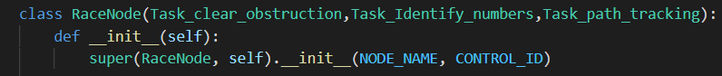

每个关卡类均从`PublicNode`中继承，slam的位置信息通过`/initialpose`主题获得，机器人的控制指令由`/gaitCommand`主题发布。

在比赛中，机器人在场地中的位置从slam获取，因此首先需要**建图**

### slam建图

- 检查bodyhub节点和摄像头正常启动<br>

bodyhub节点是上位机其他节点与下位机通信的中间节点，机器人的所有控制指令的发送和机器人数据的获取都通过此节点进行,因此进行任何控制指令下发前都要确保bodyhub节点已经启动。不过机器人启动时默认会调用位于`~/robot_ros_application/scripts/start.sh`的脚本启动机器人所有节点(当然也包含bodyhub节点和摄像头节点)。

因此，可以先输入 `rosnode list` 进行查询start.sh脚本是否已经开机启动。

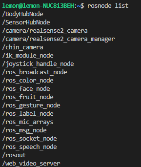

命令输出如上图所示，可能会比上图显示的结果多，要保证的是 `BodyHubNode` 、 `/camera/realsense2_camera` 和 `/camera/realsense2_camera_manager` 存在即可

若没有 `bodyhubnode` 和 `realsense2_camera` 相关的node，或者直接报`Unable to communicate with master!`，则需要手动执行 `~/robot_ros_application/scripts/start.sh` 启动节点。
```shell
  $ cd ~/ && ./start.sh
```

- 运行建图
  
  运行建图之前先将机器人放在起点位置
  
  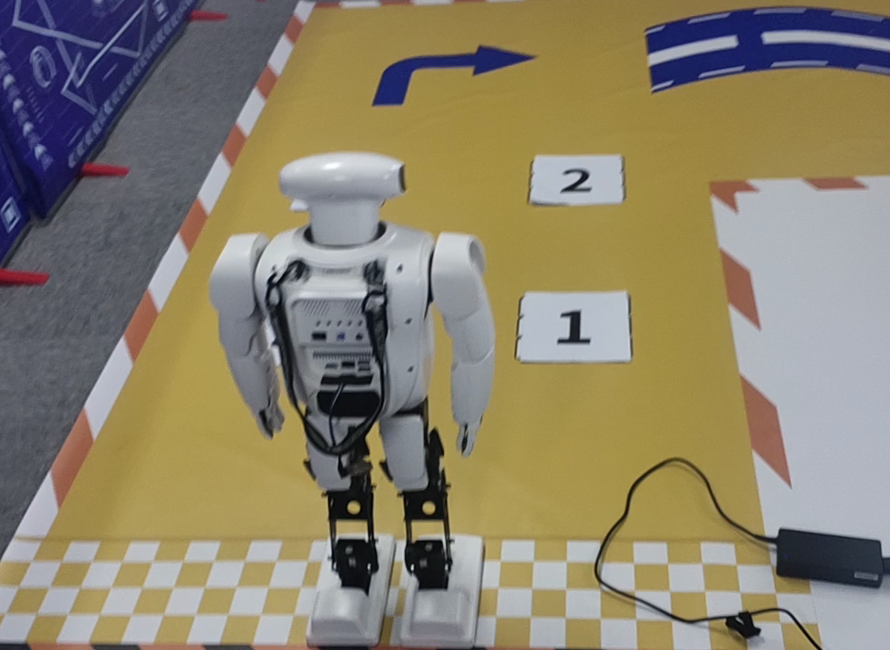
  
  然后在终端启动slam建图.

```shell
  #在vnc或者MobaXterm中(可以显示图形界面)
  $ source ~/robot_ros_application/catkin_ws/devel/setup.bash
  $ rosrun SLAM RGBD true false #参数1为true表示使用显示,参数2为false表示建图模式(true为定位模式)
```
>#**source**命令在下文中很多地方都需要，这是ros的**环境变量配置**，不执行将找不到项目中的ros包，下文中在执行rosrun之前和打开新终端的时候请自行执行该句，**不再提示**

启动后可以在屏幕中看到两个显示窗口

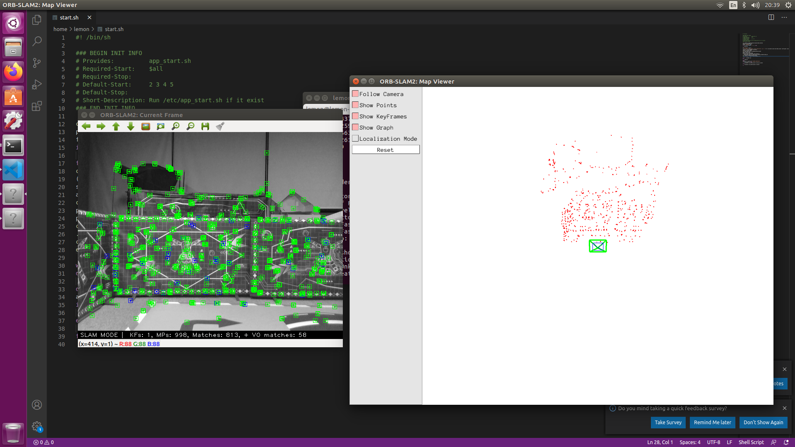

左侧为相机图像，右侧为实时slam特征点和关键帧的点云图。

在RGB图片中，紫色的点代表原来地图上已经有的关键点，绿色的点代表重新识别出来的关键点。在点云图中，绿色的方框代表当前位置，红色的点云代表当前RGB图像在点云图上的位置，黑色的点代表已经识别的点云。建图的时候可以根据屏幕上显示的信息甄别建图的好坏。

- 建图要点

建图时需要手动移动机器人的位置，再缓慢地转动机器人，使机器人看到周围的挡板，在一个位置扫完一圈后需要缓慢地移动机器人到下一个不远的位置，`缓慢`的程度可以参考显示界面上的rgb和点云图，原则是尽量保持rgb图像在每个时刻都有特征点识别出来（移动太快会丢掉当前位置，导致点云信息无法拼接）。

>有一个辅助建图的脚本位于`colleges/scripts/slam_map.py`下，直接使用python运行该文件即可进入命令行控制模式，按下`e`键可以使机器人头部匀速旋转，从而可以不用手动转动机器人。

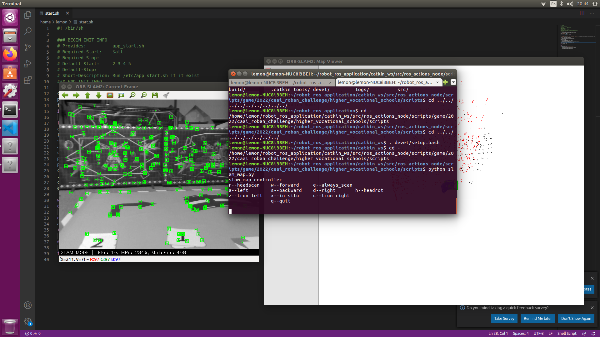

扫完一遍场地后可以看到场地围挡的轮廓已经基本成型

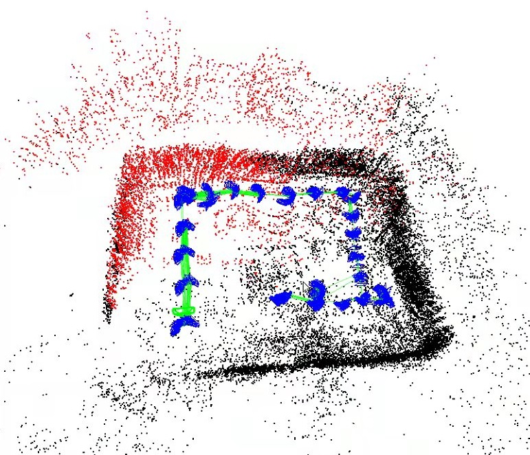

此时可以将点云图左侧的Localization Mode打开，从而切换到定位模式(不更新地图)。到处移动机器人，如果看到有地方无法识别出特征点或者定位错误，可以在此前正确的位置打开Localization Mode复选框，缓慢移动到缺少特征点的位置，从而修正地图。

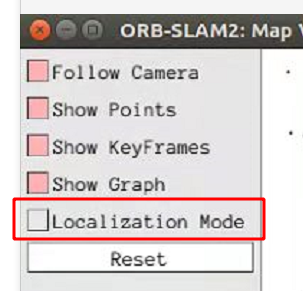

建图时应尽量避免如下所示的`双重墙`的问题(一般是由于移动过快导致定位丢失所致)

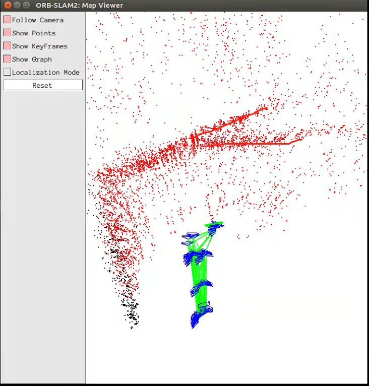

出现双重墙时也不要慌，如果不想重新建图，可以尽快将机器人的摄像头移动到此前可以正确定位的位置，然后再缓慢地移动到出现双重墙的位置，让建图算法识别出闭环更新地图。

建图完成后直接ctrl+c停止建图并保存地图，地图应当适当备份，以免丢失重建。

建图完成后如果想要在原有地图上**附加建图**，可以再次运行建图脚本，将最后的参数改为true(否则将覆盖原有地图)

```shell
  #在vnc或者MobaXterm中(可以显示图形界面)
  $ source ~/robot_ros_application/catkin_ws/devel/setup.bash

  #注意这个最后的参数是true表示定位模式，为false的话会直接覆盖掉地图进行重新建
  $ rosrun SLAM RGBD true true#参数1为true表示使用显示,参数2为false表示建图模式(true为定位模式)
```

然后在点云图的窗口左侧关闭Localization Mode即可。

### slam标定

建图完成后即可对地图上的导航点进行标定。

- 运行slam
  
  ```shell
    #在vnc或者MobaXterm中(可以显示图形界面)
    $ source ~/robot_ros_application/catkin_ws/devel/setup.bash

    #注意这个最后的参数是true表示定位模式
    $ rosrun SLAM RGBD true true
  ```

- slam位置输出
  
  slam位置通过订阅`/initialpose`主题即可获得，也可以通过运行辅助建图脚本进行输出。
  
  ```shell
    $ source ~/robot_ros_application/catkin_ws/devel/setup.bash 

    #最后随便给个参数即可
    $ python ~/robot_ros_application/catkin_ws/src/ros_actions_node/scripts/game/2022/caai_roban_challenge/colleges/scripts/slam_map.py 1
  ```
  
  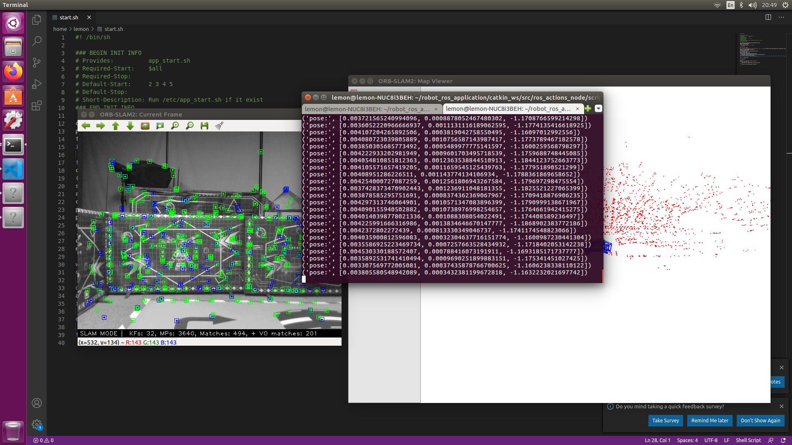

#### 需要标定的位置

每个关卡有一个对应的slam标定yaml文件，命名格式为`slam_关卡名.yaml`

- 第一关

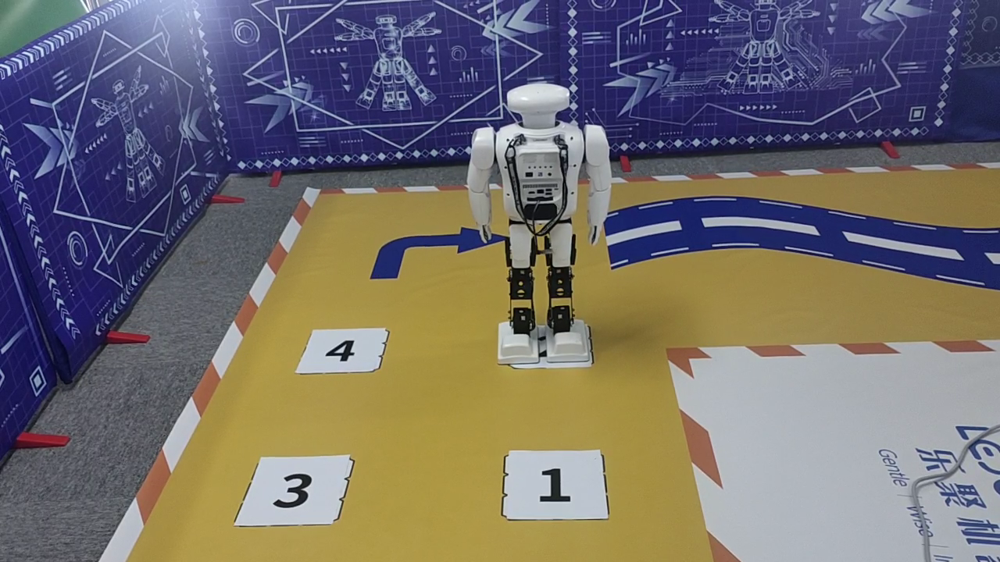

如上图所示，打开slam位置输出后，将机器人分别移动到途中的1234中，打开`slam_identify_num.yaml`文件，将终端输出的位置分别填入对应位置的字段中。

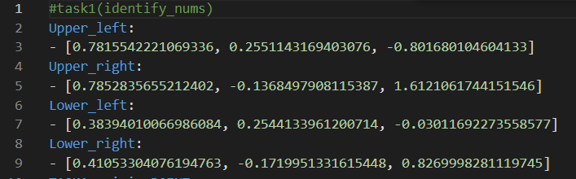

- 第二关

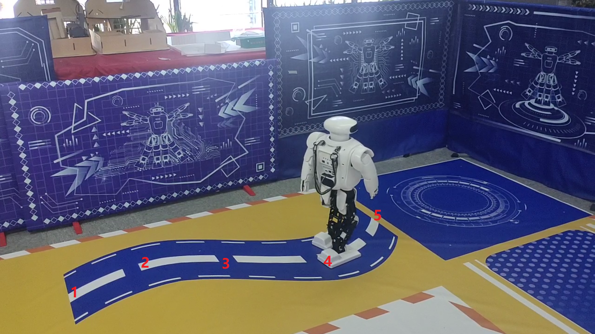

将机器人分别放于上图中的12345点，然后打开slam_path_tracking.yaml文件，依次将终端输出的点位填入，也可以自行增删点。

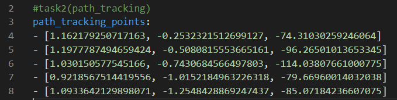

- 第三关

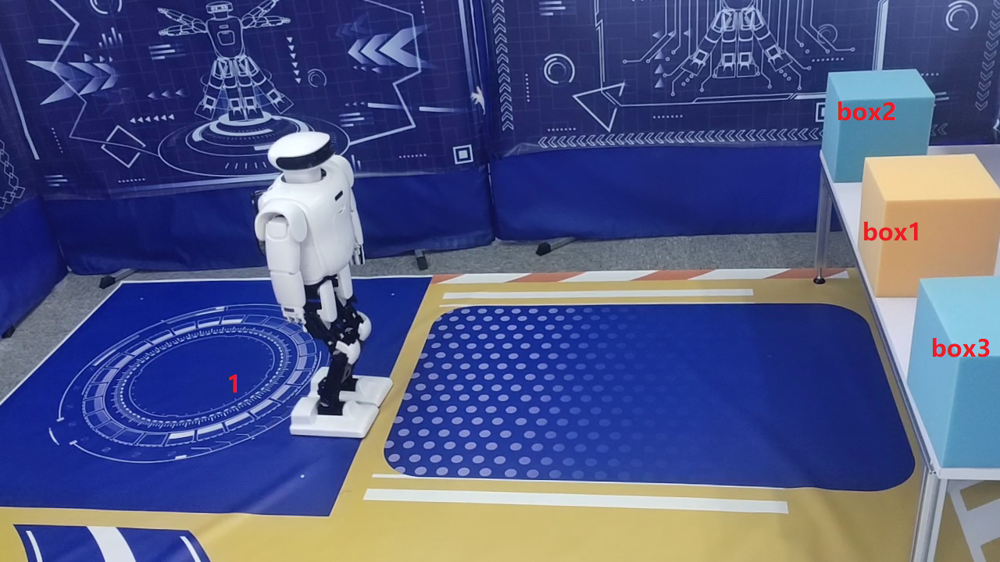

如上图所示第三关需要标记4个点，打开slam_carry_box.yaml文件，把机器人放于上图中的1,box_n四个点，1点为搬运的原点和目的点，标记box_n前的点时需要避免离桌子太近(保持3-4cm)，否则可能会碰到桌子摔倒。

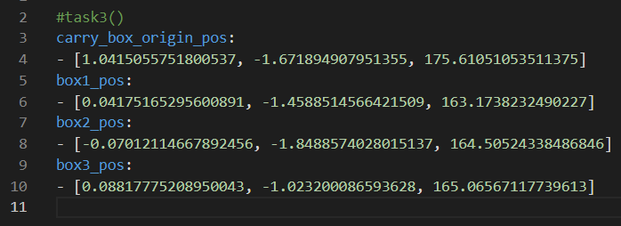

## 关卡运行

在运行关卡之前要确保 SLAM 程序已经运行，详情参考 “运行slam” 部分。

比赛中的每个关卡都单独以`Task_关卡名.py`的形式封装起来，在该文件里面有一个`Task_关卡名`的class继承自PublicNode，在每个类中有一个`start_关卡名`的类函数作为该关卡入口、实现关卡逻辑。初始化时传入NODE_NAME和CONTROL_ID即可实例化一个节点。关卡类会在`roban_challenge_main.py` 中被import并通过多重继承的方式实例化为一个节点，从而将需要的关卡串联起来。同时每个关卡封装的文件`Task_关卡名.py`也可以单独运行进行测试。<br>
因此，要运行所有关卡的测试，使用：
```shell
  # 一定要先source一下工作空间，新开的终端都要source一下
  $ source ~/robot_ros_application/catkin_ws/devel/setup.bash 

  $ python ~/robot_ros_application/catkin_ws/src/ros_actions_node/scripts/game/2022/caai_roban_challenge/colleges/scripts/roban_challenge_main.py
```
### 第一关运行流程

> 以下文件夹的路径没有说明都是基于[比赛项目源码的路径](#link1)，**每次启动终端运行关卡都要source工作空间**

单独运行第一关时使用：
```shell
  $ python ~/robot_ros_application/catkin_ws/src/ros_actions_node/scripts/game/2022/caai_roban_challenge/colleges/scripts/Task_identify_numbers.py
  #在配置好文件权限和source工作空间后也可以使用rosrun的方法启动rosrun ros_actions_node Task_identify_numbers.py 以下的关卡同理
```

- 高校比赛第一关是识别出四个数字的在四个备选位置中的位置关系然后依次走过去。数字通过训练好的模型识别。Identifier 用于数字识别，调用 Identifier.get_numbers_pos() 即获得各个数字的位置（左上、左下、右上、右下）

直接运行该关卡的脚本也可以以单独的节点运行该关卡，运行该关卡时首先执行RobanFrames中的动作帧squat_frames，该动作实现机器人弯腰并低头，用以看全地图上的四个位置。

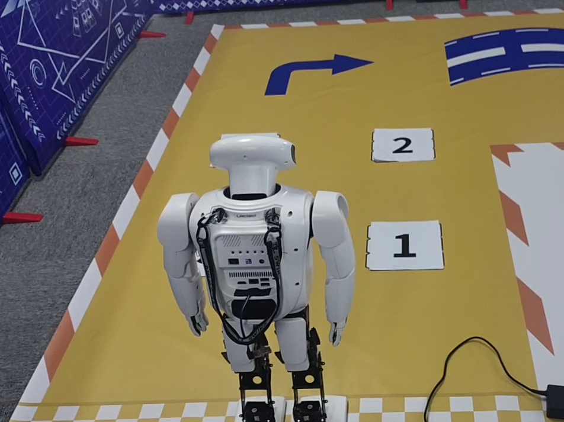

- 如果无法识别数字位置，可以查看摄像头是否看清四个数字位置，通过 `机器人IP:8080` 的网址，选择 `/camera/color/image_raw` 即可查看头部摄像头的图像回传

另外，由于机器人往前看和往后看在slam地图中差了大约一个头的距离，因此需要对机器人的位置进行校正，脚本开头的Adjust_len变量存储了机器人往前和往后看时的距离差(可以自行将机器人角度反转180°输入slam位置计算得到)，在关卡实现中做路径规划时使用该值进行标定点的校正。

### 第二关运行流程

单独运行第二关时使用：
```shell
  $ python ~/robot_ros_application/catkin_ws/src/ros_actions_node/scripts/game/2022/caai_roban_challenge/colleges/scripts/Task_path_tracking.py
```

第二关代码的主要结构与第一关类似，不再累赘。关卡实现是直接调用path_tracking函数，然后传入标记的路径点即可，需要注意的是path_tracking函数的参数，比如是否忽略角度，终点位置误差，以及等待slam定位稳定的时间等可以自行调节以获得更好的性能。


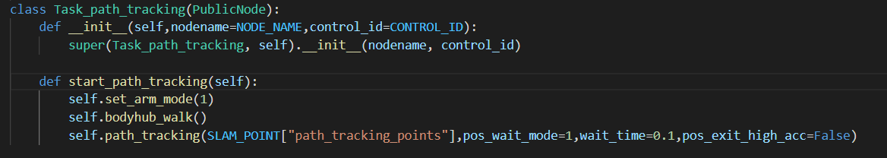

### 第三关运行流程

单独运行第三关时：
```shell
  $ python ~/robot_ros_application/catkin_ws/src/ros_actions_node/scripts/game/2022/caai_roban_challenge/colleges/scripts/Task_carry_box.py
```

第三关为搬运箱子，进入第三关后通过slam导航到箱子所在位置然后播放搬运动作，然后将箱子搬运回第三关起点即可。

机器人的搬运的动作由roban软件生成，生成之后存入frames.py文件中的RobanFrames动作类中使用。搬运动作开始后需要使用调用set_arm_mode(0)函数取消掉手部的行走动作。到达终点时调用`self.bodyhub_ready()`即可将方块放下。

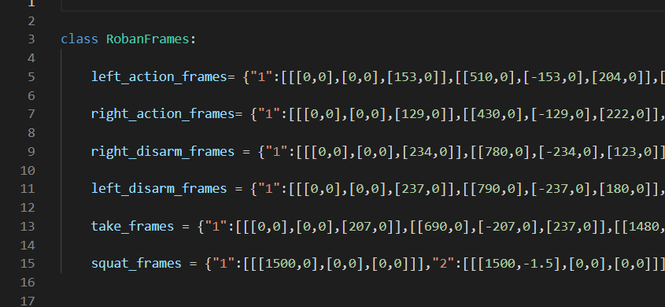

其中该关卡中使用到的take_frames为搬运动作，注意自行设计动作时需要避免撞到桌子。

#### 关于机器人动作帧生成

机器人动作帧统一存放于同目录的frames.py文件的RobanFrames类变量中.

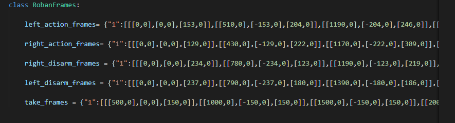

动作帧文件由pc端Roban软件生成

生成步骤如下:

1.打开roban软件,连接机器人

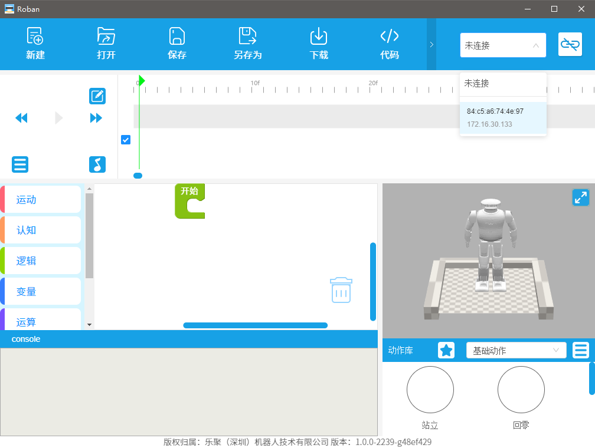

2.在上方时间轴区域设置时间范围,以100f为1s,然后在第一帧处右键>>插入关键帧>>设置全身关键帧

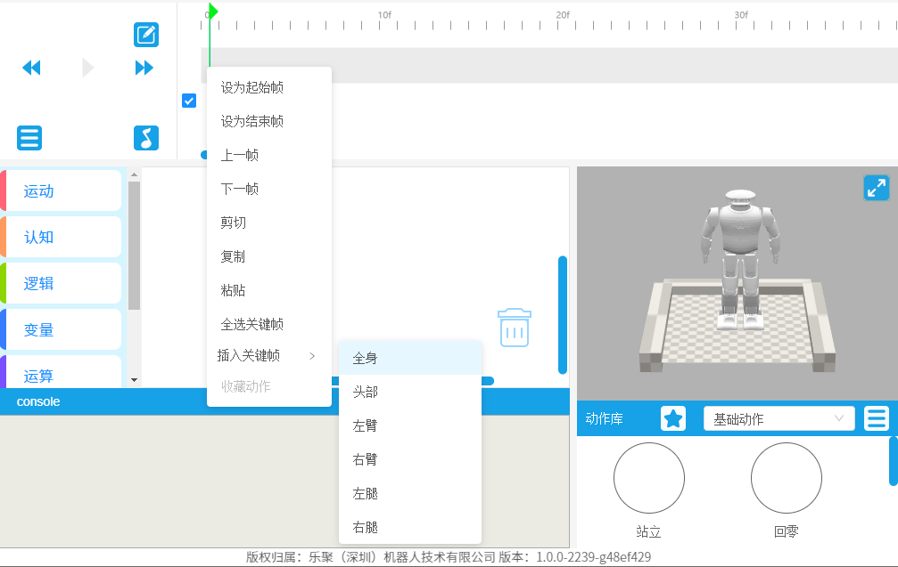

3.然后同样地在所需要的下一个动作点的时间(100f为1s)插入手部或其他部位关键帧,然后点击右下角的3D图中的部位进行动作设置

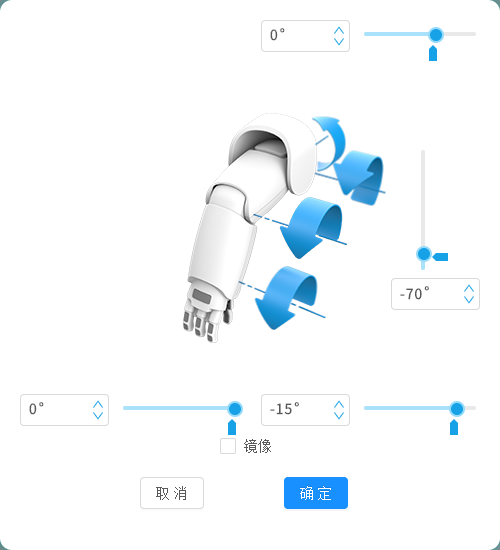

4.设置完所有动作关键帧后,点击左侧的菜单图标选择生成模块

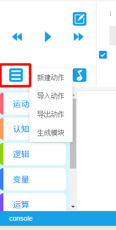

5.在中间的图形化编程区将生成的模块拖入到开始中即可点击菜单中的`代码`选项复制出生成的动作帧到frames.py文件中的相应位置使用

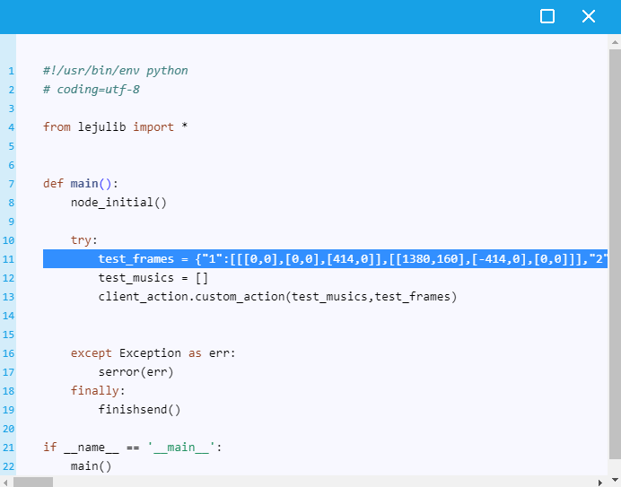

# Q&A
1. 出现`no module name xxxx`eg:`No module named mediumsize_msgs.srv`之类的错误<br>
确保已经source了工作空间
```shell
  $ source ~/robot_ros_application/catkin_ws/devel/setup.bash
```
2. 在编译slam时卡住，或运行slam的时候卡住<br>
可能是内存不足，可以尝试增加虚拟内存分区
```shell
  $ free -m  #查看当前分区情况
  $ sudo dd if=/dev/zero of=/var/swap bs=1G count=8   #增加 swap 大小, 8G 左右
  $ sudo mkswap /var/swap #设置交换文件
  $ sudo swapon /var/swap #立即激活启用交换分区
```
3. 建图或其他没有接屏幕情况下使用vnc连接时图像十分卡顿<br>
将机器人接一下显示器或者设置虚拟屏幕可以解决；
参考[ubuntu无屏显示](https://blog.csdn.net/qq_49466306/article/details/112398503)

4. 使用`rosrun ros_actions_node xx.py`方式执行时找不到该文件<br>
在确保已经source工作空间的情况下，将需要执行的文件添加可执行权限。例如：
`chmod +x slam_map.py`之后再用`rosrun ros_actions_node slam_map.py` 执行。

