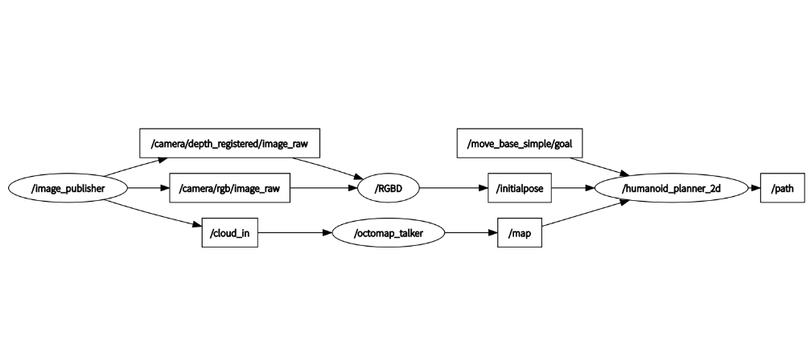
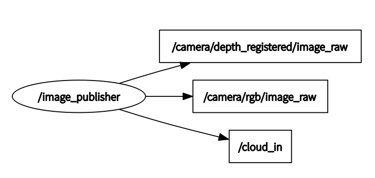
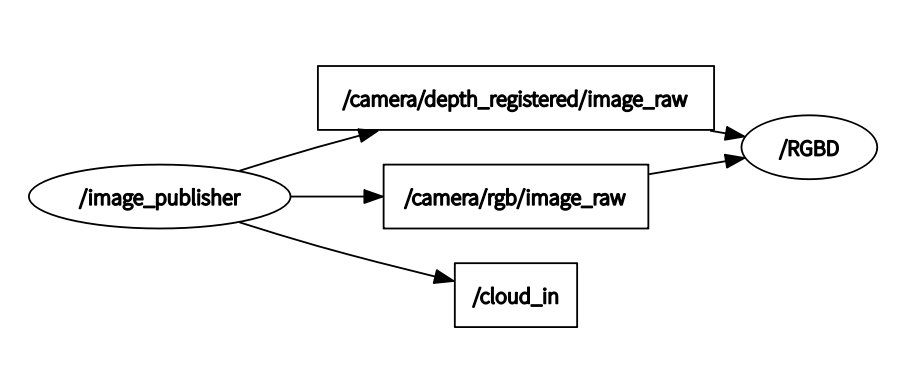
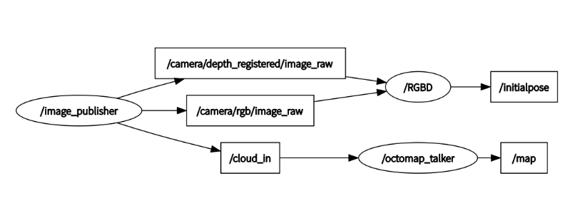

### SLAM

rqt_graph_navi.png



rqt_graph_publisher.png



rqt_graph_publisher_orbslam2.png



rqt_octomap.png



### 


## Action tree


```
├── CMakeLists.txt

├── __init__.py

├── msg

│  └── DeviceList.msg

├── package.xml

└── scripts

​    ├── action

​    │  ├── demo_frame.py

​    │  ├── __init__.py

​    │  └── kickball_frame.py

​    ├── aging_test

​    │  ├── config

​    │  │  └── config.json

​    │  ├── launch

​    │  │  └── aging_stair_artag.launch

​    │  └── scripts

​    │      └── artag_tracking_reciprocating.py

​    ├── balance_face_tracking

​    │  ├── balance_board.py

​    │  ├── balance_face_tracking_main.py

​    │  ├── face_tracking.py

​    │  ├── __init__.py

​    │  ├── lejulib.py -> ../../../leju_lib_pkg/lejulib.py

​    │  └── 自平衡+人脸追踪文档.md

​    ├── botec

​    │  ├── bodyhub_action.py

​    │  ├── botec_main.py

​    │  ├── botec比赛示例程序参考文档.md

​    │  ├── botec程序接口说明文档.md

​    │  ├── chin_cam.launch

​    │  ├── image_detect.py

​    │  ├── image_manager.py

​    │  ├── img

​    │  │  ├── 1.png

​    │  │  ├── 2.png

​    │  │  ├── 3.png

​    │  │  ├── 4.png

​    │  │  ├── 5.png

​    │  │  ├── 66.png

​    │  │  ├── 6.png

​    │  │  ├── 7.png

​    │  │  ├── 8.png

​    │  │  ├── map.png

​    │  │  ├── seesawstar.jpg

​    │  │  ├── seesw.jpg

​    │  │  └── update.jpg

​    │  ├── __init__.py

​    │  ├── minefield.py

​    │  ├── navigation.py

​    │  ├── open_door.py

​    │  ├── pendulum_bob.py

​    │  ├── pose_board.py

​    │  ├── run_slam.sh -> ../../../leju_lib_pkg/src/lejufunc/run_slam.sh

​    │  ├── seesaw.py

​    │  ├── to_pile.py

​    │  └── turntable.py

​    ├── botec_company

​    │  ├── bodyhub_action.py

​    │  ├── botec_company_instructions

​    │  │  ├── botec_company_instructions.md

​    │  │  └── img

​    │  │      ├── 10.png

​    │  │      ├── 11.png

​    │  │      ├── 12.png

​    │  │      ├── 13.png

​    │  │      ├── 14.jpg

​    │  │      ├── 14.png

​    │  │      ├── 15.png

​    │  │      ├── 16.png

​    │  │      ├── 17.png

​    │  │      ├── 18.png

​    │  │      ├── 19.png

​    │  │      ├── 1.png

​    │  │      ├── 20.jpg

​    │  │      ├── 2.png

​    │  │      ├── 3.png

​    │  │      ├── 4.png

​    │  │      ├── 5.png

​    │  │      ├── 6.png

​    │  │      ├── 7.png

​    │  │      ├── 8.png

​    │  │      ├── 9.jpg

​    │  │      └── update.jpg

​    │  └── pose_board_company.py

​    ├── BOTEC演示关卡案例.py

​    ├── check_gait

​    │  ├── bodyhub_action.py

​    │  ├── check_walking.py

​    │  ├── config.yaml

​    │  ├── gait.py

​    │  ├── march_on_the_spot.py

​    │  └── walking_node.sh

​    ├── climb_stairs.py

​    ├── compete

​    │  ├── all_levels.py

​    │  ├── ball2stairs.py

​    │  ├── clock.py

​    │  ├── demo_slam.py

​    │  ├── door.py

​    │  ├── down_stairs.py

​    │  ├── get_slam_point.py

​    │  ├── hollow_out.py

​    │  ├── hurdle.py

​    │  ├── image_manager.py

​    │  ├── joy_move.py

​    │  ├── kick_ball.py

​    │  ├── landmine.py

​    │  ├── last.py

​    │  ├── narrow_bridge.py

​    │  ├── pendulum.py

​    │  ├── press_door.py

​    │  ├── robot_params.yaml

​    │  ├── stair_convert.py

​    │  ├── up2down.py

​    │  └── up_stairs.py

​    ├── demo_act_bezier.py

​    ├── demo_music_test.py

​    ├── door.py

​    ├── fruits_action_files

​    │  ├── fruit0.py

​    │  ├── fruit1.py

​    │  ├── fruit2.py

​    │  └── lejulib.py -> /home/lemon/robot_ros_application/catkin_ws/src/leju_lib_pkg/lejulib.py

​    ├── game

​    │  └── 2022

​    │      ├── caai_roban_challenge

​    │      │  ├── colleges

​    │      │  │  ├── image

​    │      │  │  │  ├── 0-1.jpg

​    │      │  │  │  ├── 0-2.png

​    │      │  │  │  ├── 0-3.jpg

​    │      │  │  │  ├── 0-4-1.png

​    │      │  │  │  ├── 0-4.jpg

​    │      │  │  │  ├── 0-4.png

​    │      │  │  │  ├── 0-5.png

​    │      │  │  │  ├── 0-6.png

​    │      │  │  │  ├── 1-1.png

​    │      │  │  │  ├── 1-2.png

​    │      │  │  │  ├── 1-3.png

​    │      │  │  │  ├── 1-4.png

​    │      │  │  │  ├── 1-5.png

​    │      │  │  │  ├── 1-6.png

​    │      │  │  │  ├── 1-7.png

​    │      │  │  │  ├── 1-8.jpg

​    │      │  │  │  ├── 1-9.png

​    │      │  │  │  ├── 3.10.png

​    │      │  │  │  ├── 3-11.png

​    │      │  │  │  ├── 3-12.png

​    │      │  │  │  ├── 3-1.png

​    │      │  │  │  ├── 3-2.jpg

​    │      │  │  │  ├── 3-3.jpg

​    │      │  │  │  ├── 3-6.jpg

​    │      │  │  │  ├── 3-7.jpg

​    │      │  │  │  ├── 3-8.png

​    │      │  │  │  ├── 3.9.png

​    │      │  │  │  ├── 原相机图像.png

​    │      │  │  │  ├── 模板匹配结果.png

​    │      │  │  │  ├── 模板图片.png

​    │      │  │  │  ├── 灰度图像.png

​    │      │  │  │  └── 透视变换.png

​    │      │  │  ├── number_img

​    │      │  │  │  ├── 1.jpg

​    │      │  │  │  ├── 2.jpg

​    │      │  │  │  ├── 3.jpg

​    │      │  │  │  └── 4.jpg

​    │      │  │  ├── Readme.md

​    │      │  │  └── scripts

​    │      │  │      ├── bodyhub_action.py

​    │      │  │      ├── frames.py

​    │      │  │      ├── __init__.py

​    │      │  │      ├── public.py

​    │      │  │      ├── roban_challenge_main.py

​    │      │  │      ├── slam_carry_box.yaml

​    │      │  │      ├── slam_identify_num.yaml

​    │      │  │      ├── slam_map.py

​    │      │  │      ├── slam_path_tracking.yaml

​    │      │  │      ├── Task_carry_box.py

​    │      │  │      ├── Task_identify_numbers.py

​    │      │  │      └── Task_path_tracking.py

​    │      │  └── higher_vocational_schools

​    │      │      ├── image

​    │      │      │  ├── 0-1.jpg

​    │      │      │  ├── 0-2.png

​    │      │      │  ├── 0-3.jpg

​    │      │      │  ├── 0-4-1.png

​    │      │      │  ├── 0-4.jpg

​    │      │      │  ├── 0-4.png

​    │      │      │  ├── 0-5.png

​    │      │      │  ├── 0-6.png

​    │      │      │  ├── 1-1.png

​    │      │      │  ├── 1-2.png

​    │      │      │  ├── 1-3.png

​    │      │      │  ├── 1-4.png

​    │      │      │  ├── 1-5.png

​    │      │      │  ├── 1-6.png

​    │      │      │  ├── 1-7.png

​    │      │      │  ├── 1-8.jpg

​    │      │      │  ├── 1-9.png

​    │      │      │  ├── 3.10.png

​    │      │      │  ├── 3-11.png

​    │      │      │  ├── 3-12.png

​    │      │      │  ├── 3-1.jpg

​    │      │      │  ├── 3-2.jpg

​    │      │      │  ├── 3-3.jpg

​    │      │      │  ├── 3-4.jpg

​    │      │      │  ├── 3-5.jpg

​    │      │      │  ├── 3-6.jpg

​    │      │      │  ├── 3-7.jpg

​    │      │      │  ├── 3-8.png

​    │      │      │  ├── 3.9.png

​    │      │      │  ├── 原相机图像.png

​    │      │      │  ├── 图像二值化.png

​    │      │      │  ├── 识别结果.png

​    │      │      │  └── 透视变换.png

​    │      │      ├── number_img

​    │      │      │  ├── 1.jpg

​    │      │      │  ├── 2.jpg

​    │      │      │  ├── 3.jpg

​    │      │      │  └── 4.jpg

​    │      │      ├── Readme.md

​    │      │      └── scripts

​    │      │          ├── bodyhub_action.py

​    │      │          ├── frames.py

​    │      │          ├── public.py

​    │      │          ├── roban_challenge_main.py

​    │      │          ├── slam_clear_obstruction.yaml

​    │      │          ├── slam_identify_num_n.yaml

​    │      │          ├── slam_map.py

​    │      │          ├── slam_path_tracking.yaml

​    │      │          ├── Task_clear_obstruction.py

​    │      │          ├── Task_identify_numbers_n.py

​    │      │          └── Task_path_tracking.py

​    │      └── normal_sim_game

​    │          └── ai_innovative_roban_sim

​    │              ├── CMakeLists.txt

​    │              ├── package.xml

​    │              ├── player_scripts

​    │              │  ├── cascade.xml

​    │              │  ├── demo.py

​    │              │  ├── README.md

​    │              │  ├── task01_press_button.py

​    │              │  ├── task02_hand_tea.py

​    │              │  └── task03_garbage_classification.py

​    │              ├── README.md

​    │              ├── scripts

​    │              │  ├── auto_run

​    │              │  │  ├── bodyhub.sh

​    │              │  │  ├── complete_tool.py

​    │              │  │  ├── kill_all.sh

​    │              │  │  ├── node_start.sh

​    │              │  │  ├── python_P

​    │              │  │  │  ├── demo.sh

​    │              │  │  │  ├── python10.sh

​    │              │  │  │  ├── python1.sh

​    │              │  │  │  ├── python2.sh

​    │              │  │  │  ├── python3.sh

​    │              │  │  │  ├── python4.sh

​    │              │  │  │  ├── python5.sh

​    │              │  │  │  ├── python6.sh

​    │              │  │  │  ├── python7.sh

​    │              │  │  │  ├── python8.sh

​    │              │  │  │  └── python9.sh

​    │              │  │  ├── random_position.sh

​    │              │  │  └── start_vrep

​    │              │  │      ├── start_vrep10.sh

​    │              │  │      ├── start_vrep1.sh

​    │              │  │      ├── start_vrep2.sh

​    │              │  │      ├── start_vrep3.sh

​    │              │  │      ├── start_vrep4.sh

​    │              │  │      ├── start_vrep5.sh

​    │              │  │      ├── start_vrep6.sh

​    │              │  │      ├── start_vrep7.sh

​    │              │  │      ├── start_vrep8.sh

​    │              │  │      └── start_vrep9.sh

​    │              │  ├── sim_image_convert_slam_form.py

​    │              │  └── vrep

​    │              │      ├── complexCommandTest.py

​    │              │      ├── depth_image_encoding.py

​    │              │      ├── pathPlanningTest.py

​    │              │      ├── pController.py

​    │              │      ├── ply.py

​    │              │      ├── readMe.txt

​    │              │      ├── sendMovementSequence-mov.py

​    │              │      ├── sendMovementSequence-pts.py

​    │              │      ├── sendSimultan2MovementSequences-mov.py

​    │              │      ├── simConst.py

​    │              │      ├── simpleSynchronousTest.py

​    │              │      ├── simpleTest.py

​    │              │      ├── sim.py

​    │              │      ├── synchronousImageTransmission.py

​    │              │      └── visualization.py

​    │              └── vrep

​    │                  ├── ai_innovative_roban_sim_task01_press_button.ttt

​    │                  ├── ai_innovative_roban_sim_task02_press_button.ttt

​    │                  ├── ai_innovative_roban_sim_task03_hand_tea.ttt

​    │                  ├── ai_innovative_roban_sim_task04_hand_tea.ttt

​    │                  ├── ai_innovative_roban_sim_task05_shutdown_valve.ttt

​    │                  ├── ai_innovative_roban_sim_task06_shutdown_valve.ttt

​    │                  ├── ai_innovative_roban_sim_task07_garbage_classification.ttt

​    │                  ├── ai_innovative_roban_sim_task08_garbage_classification.ttt

​    │                  ├── ai_innovative_roban_sim_task09_upstair.ttt

​    │                  ├── ai_innovative_roban_sim_task0.ttt

​    │                  └── ai_innovative_roban_sim_task10_upstair.ttt

​    ├── hurdle.py

​    ├── ik_module_climbstairs.py

​    ├── __init__.py

​    ├── integrated_apply.py

​    ├── lejufunc -> ../../leju_lib_pkg/src/lejufunc

​    ├── lejulib.py -> ../../leju_lib_pkg/lejulib.py

​    ├── roban_practice_course

​    │  └── scripts

​    │      ├── practice_demo

​    │      │  ├── demo_walking_node.py

​    │      │  ├── imageProcessing.py

​    │      │  ├── NXIUGAI0429.py

​    │      │  ├── pidAlgorithm.py

​    │      │  ├── status_change.py

​    │      │  └── walking_s_route.py

​    │      └── roban_challenge

​    │          ├── bodyhub_action.py

​    │          ├── kick_ball_practice.py

​    │          └── roban_challenge_practice.py

​    ├── Robot_drive_and_control_technology

​    │  └── robot_usage_overview.py

​    ├── run_stair.sh

​    ├── Say-yeah舞蹈案例.py

​    ├── shell

​    │  ├── botec_company_demo.sh

​    │  ├── botec.sh

​    │  ├── pile_node_company.sh

​    │  ├── pile_node.sh

​    │  ├── run_slam.sh -> ../../../leju_lib_pkg/src/lejufunc/run_slam.sh

​    │  ├── stair_node_company.sh

​    │  └── stair_node.sh

​    ├── stair_convert

​    │  ├── stair_convert_artag.conf

​    │  └── stair_convert_artag.py

​    ├── S形曲线行走案例.py

​    ├── tracking

​    │  ├── haarcascade_frontalface_alt2.xml

​    │  ├── __init__.py

​    │  ├── objcenter.py

​    │  └── pid.py

​    ├── tts_lookHappy.py

​    ├── tts_notEatApple.py

​    ├── tts_ohYeah.py

​    ├── utils

​    │  ├── artag

​    │  │  ├── __init__.py

​    │  │  ├── launch

​    │  │  │  ├── MultiMarkerMap.xml

​    │  │  │  └── roban_chin_camera_multi.launch

​    │  │  ├── MapGenerator.py

​    │  │  └── multiARtag_detecter.py

​    │  ├── __init__.py

​    │  └── keyboardlistener.py

​    ├── walk_narrow_bridge.py

​    ├── 上楼梯案例.py

​    ├── 下蹲.py

​    ├── 举手.py

​    ├── 人脸追踪案例.py

​    ├── 伸展手臂.py

​    ├── 原地踏步.py

​    ├── 当前电量.py

​    ├── 抗扰动案例.py

​    ├── 摇头.py

​    ├── 武当太极.py

​    ├── 点头.py

​    ├── 网络状态.py

​    ├── 自平衡+人脸追踪.py

​    ├── 自平衡案例.py

​    ├── 舵机扫描.py

​    ├── 踢红球案例.py

​    ├── 退出自平衡.py

​    ├── 避障案例.py

​    ├── 鞠躬.py

​    └── 高职招生宣讲.py

48 directories, 329 files
```


### leju_lib


```
├── CMakeLists.txt

├── __init__.py

├── lejulib.py

├── notify.ps1

├── package.xml

├── README.md

├── scripts

│  ├── analyze_ImuData.py

│  └── url_downloading.py

├── setup.py

├── src

│  ├── algorithm

│  │  ├── __init__.py

│  │  ├── __init__.pyc

│  │  ├── pidAlgorithm.py

│  │  └── pidAlgorithm.pyc

│  ├── ik_lib

│  │  ├── ikmodulesim

│  │  │  ├── CtrlType.py

│  │  │  ├── CtrlType.pyc

│  │  │  ├── ikmodulesim.py

│  │  │  ├── ikmodulesim.pyc

│  │  │  ├── __init__.py

│  │  │  └── __init__.pyc

│  │  ├── __init__.py

│  │  ├── __init__.pyc

│  │  └── paramofposture

│  │      ├── __init__.py

│  │      ├── __init__.pyc

│  │      ├── paramofposture.py

│  │      └── paramofposture.pyc

│  ├── lejufunc

│  │  ├── bezier.py

│  │  ├── bezier.pyc

│  │  ├── bodyhub_action.py

│  │  ├── client_action.py

│  │  ├── client_action.pyc

│  │  ├── client_audio.py

│  │  ├── client_button.py

│  │  ├── client_color.py

│  │  ├── client_controller.py

│  │  ├── client_face.py

│  │  ├── client_gripper.py

│  │  ├── client_label.py

│  │  ├── client_logger.py

│  │  ├── client_logger.pyc

│  │  ├── client_sensor.py

│  │  ├── client_speech.py

│  │  ├── client_video.py

│  │  ├── client_wakeup.py

│  │  ├── client_walk.py

│  │  ├── color_detect.py

│  │  ├── identify_digit.py

│  │  ├── __init__.py

│  │  ├── __init__.pyc

│  │  ├── public.py

│  │  ├── README.md

│  │  ├── run_slam.sh

│  │  ├── ServoJointTrajectory.py

│  │  ├── ServoJointTrajectory.pyc

│  │  ├── slam.py

│  │  ├── utils.py

│  │  └── utils.pyc

│  ├── motion

│  │  ├── bezierPlan.py

│  │  ├── bezierPlan.pyc

│  │  ├── bodyhub_client.py

│  │  ├── bodyhub_client.pyc

│  │  ├── example

│  │  │  ├── action_example.py

│  │  │  ├── bezier_traj_example.py

│  │  │  ├── __init__.py

│  │  │  ├── traj_plan_example.py

│  │  │  └── walking_example.py

│  │  ├── __init__.py

│  │  ├── __init__.pyc

│  │  ├── motionControl.py

│  │  ├── motionControl.pyc

│  │  ├── TrajectoryPlan.py

│  │  └── TrajectoryPlan.pyc

│  └── vision

│      ├── imageProcessing.py

│      ├── imageProcessing.pyc

│      └── __init__.py

└── template

     └── download_template.py

11 directories, 75 files
```


