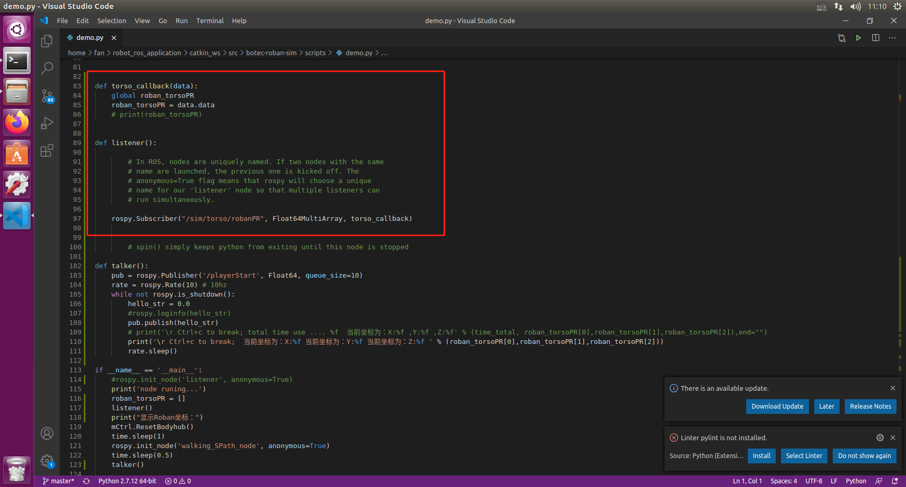

## 机器人定位

/home/fan/robot_ros_application/catkin_ws/src/Botec_Roban_Sim/player_scripts/demo.py 找到demo.py

其中是编写一个listener()函数接收信息的，具体python中怎么编写listener()和talker()的，请查看以下链接：http://wiki.ros.org/rospy_tutorials/Tutorials/WritingPublisherSubscriber#Writing_the_Subscriber_Node

解释一下代码，所谓listener()其实是订阅一个subscriber，那么这个subscriber如果要接收到来自V-rep的信息，那么所需的节点和信息类型就要和publisher的节点和信息类型匹配，之后接收到信息后调用回调函数。而在V-rep中关于roban位置信息的topic为/sim/torso/robanPR，它的信息类型为std_msgs/Float64MultiArray

获取机器人当前的位置姿态后，可以规划机器人行走到指定位置然后完成关卡。

## Roban机器人随机位置信息获取与导航

打开终端输入启动代码：`python /home/fan/robot_ros_application/catkin_ws/src/ros_actions_node/scripts/game/2022/normal_sim_game/ai_innovative_roban_sim/scripts/auto_run/complete_tool.py`，输入0，并按回车确认。

待V-rep启动后，点击ok稍等片刻即可看到Roban的位置信息。

那是在python中如何实现接收位置信息的呢？

此时，打开文件，根据这一路径：`/home/fan/robot_ros_application/catkin_ws/src/ros_actions_node/scripts/game/2022/normal_sim_game/ai_innovative_roban_sim/player_scripts/demo.py` 找到`demo.py`，并用VScode打开，打开后如下图所示：

其中编写了一个ros的订阅者(Subscriber)用于订阅vrep仿真器发布的rostopic `/sim/torso/PR`, 从而获得机器人的位置。具体的ros订阅和发布主题的机制可以参考ros官方文档：http://wiki.ros.org/rospy_tutorials/Tutorials/WritingPublisherSubscriber#Writing_the_Subscriber_Node

使用该接口获取到机器人当前的位置姿态后，可以直接规划机器人行走到指定位置然后完成关卡。