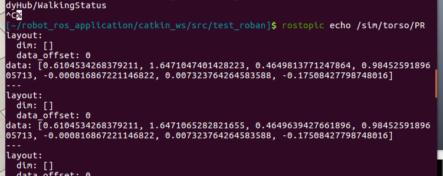

# 仿真参考文档

[ORB-SLAM2----ROS下D435相机编译与运行](https://www.zhihu.com/tardis/sogou/art/393484249)

躯干数据




已验证正确性：

```Bash
roscore
手动开[~/CoppeliaSim_Edu]$ ./coppeliaSim.sh 
手动开roban.ttt

sudo bash bodyhub.sh
rosrun ik_module ik_module_node
python test.py
```

## 仿真的topic(sim开头)


bodyhub.sh

```Bash
. /home/fan/robot_ros_application/catkin_ws/devel/setup.bash
roslaunch bodyhub bodyhub.launch sim:=True
```

node_start.sh

```Bash
sleep 3s

rosrun ik_module ik_module_node &

. /home/fan/robot_ros_application/catkin_ws/devel/setup.bash
echo "121" | sudo -S bash bodyhub.sh &
```

start_vrep.sh

```Bash
roscore &

sleep 3s

cd /home/fan/CoppeliaSim_Edu
./coppeliaSim.sh /home/fan/robot_ros_application/catkin_ws/src/bodyhub/vrep/Roban.ttt
```

test.py

```Bash
import rospy
import motion.bodyhub_client as bodycli
from ik_lib.ikmodulesim import IkModuleSim
from ik_lib.ikmodulesim.CtrlType import CtrlType as C
import algorithm.pidAlgorithm as pidAlg
from motion.motionControl import ResetBodyhub, GetBodyhubStatus, SendJointCommand
import time

class test_movement(IkModuleSim,bodycli.BodyhubClient):
    def __init__(self,debug=False):
        ResetBodyhub()
        while GetBodyhubStatus().data != "preReady":
            time.sleep(0.1)
            ResetBodyhub()
            continue
        bodycli.BodyhubClient.__init__(self,6)
        IkModuleSim.__init__(self)
        self.__pid_x = pidAlg.PositionPID(p=0.4)
        self.__pid_y = pidAlg.PositionPID(p=0.0005)
        self.__pid_d = pidAlg.PositionPID(p=0.09)

    def press_button(self):
        print("press_button")
        self.reset()
        if self.toInitPoses():
            self.body_motion([C.RArm_z, C.RArm_x], [0.165, 0.074], 20) 

            time.sleep(0.1)
            
            self.body_motion([C.RArm_x, C.RArm_y], [0.073, 0.008], 30)
            
            self.body_motion([C.RArm_z, C.RArm_x], [0.05, -0.02], 20)  
            
            self.body_motion([C.RArm_z, C.RArm_x], [-0.05, -0.05], 20)
            print("over")
        self.reset()
    def run(self):
        self.press_button()

if __name__ == '__main__':
    rospy.init_node('test', anonymous=True)
    pb = test_movement(debug= True)
    pb.run()
```

试试sudo apt-get install rosbash

/home/fan/robot_ros_application/catkin_ws/src/ros_actions_node/scripts/botec_company/botec_company_instructions/botec_company_instructions.md

src/gaitcommander/scriptes/key_cmd.py

self.boduhub_walk()

src>bodyhub>README.md

Open file:/home/fan/robot_ros_application/catkin_ws/src/bodyhub/vrep

```Plain
[~/CoppeliaSim_Edu]$ ./coppeliaSim.sh 
左上角file打开src>bodyhub>vrep>roban.ttt
[~/robot_ros_application/catkin_ws/src/ros_actions_node/scripts/game/2022/normal_sim_game/ai_innovative_roban_sim/scripts/auto_run]$ sudo bash bodyhub.sh

在执行以上后（以及后面开service），再跑其他的
/home/fan/robot_ros_application/catkin_ws/src/gaitcommander/scripts> python key_tele.py

[~/robot_ros_application/catkin_ws/src/ros_actions_node/scripts/roban_practice_course/scripts/practice_demo]$ python demo_walking_node.py                [main]
[~/robot_ros_application/catkin_ws/src/ros_actions_node/scripts/roban_practice_course/scripts/practice_demo]$ python walking_s_route.py  
```


### 抬手动作：

body_motion（见leju_lib_pkg）

自定义动作：actexecpackage中

```C++
rosrun actexecpackage ActExecPackageNode.py
rosservice call /
```

test.sh

```Bash
roscore &

sleep 3s

cd /home/fan/CoppeliaSim_Edu
./coppeliaSim.sh /home/fan/robot_ros_application/catkin_ws/src/bodyhub/vrep/Roban.ttt

cd /home/fan/robot_ros_application/catkin_ws/src/ros_actions_node/scripts/game/2022/normal_sim_game/ai_innovative_roban_sim/player_scripts/
python test.py
```

robot_ros_application/catkin_ws/src/test

nodestart.sh(三个例程的auto_run下)

```Bash
sleep 3s

rosrun  ik_module ik_module_node &

. /home/fan/robot_ros_application/catkin_ws/devel/setup.bash
echo "121" | sudo -S bash bodyhub.sh &

bash ./node_start.sh 
```