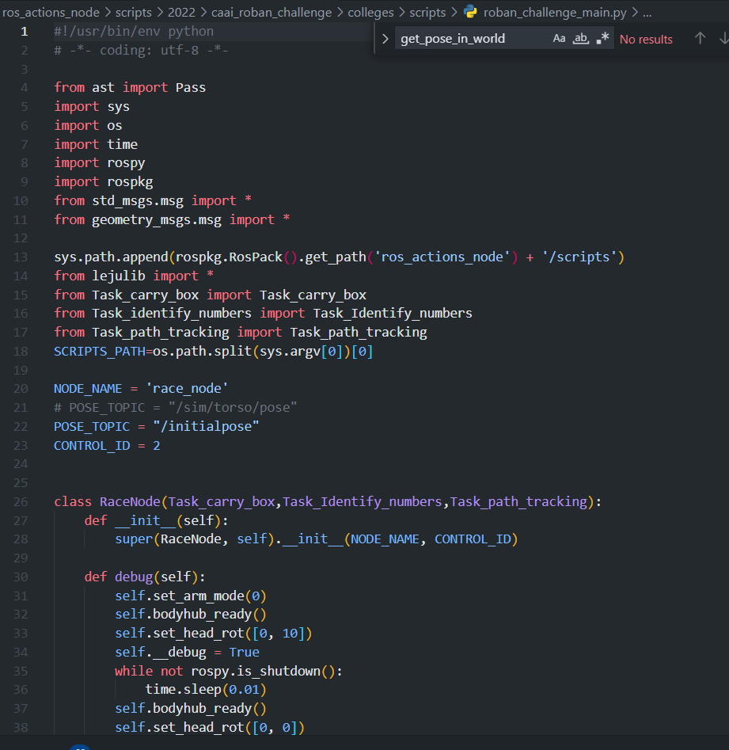

```
rosrun ros_actions_node slam_map.py
```

## 定点移动

查看当前坐标：

D:\Desktop\机器人课设\BotecBeast-master\Botec_Roban_Sim\player_scripts\demo.py

给一系列坐标Track path：

D:\Desktop\机器人课设\BotecBeast-master\ros_actions_node\scripts\caai_roban_challenge\colleges\scripts\Task_path_tracking.py

**现实比赛：carry_box和path_tracking总控**

D:\Desktop\机器人课设\BotecBeast-master\ros_actions_node\scripts\caai_roban_challenge\colleges\scripts\roban_challenge_main.py



**仿真比赛：**

D:\Desktop\机器人课设\BotecBeast-master\action_scripts\botec\botec程序接口说明文档.md


### 颜色识别

颜色识别主要在Box_color_detecter类中实现，从 `/camera/color/image_raw`主题获取摄像头数据，在关卡3图中的2位置处即开始读取颜色识别结果，因此要确保在位置2之前可以看到两个箱子

### bodymotion记录

```Python
    def main(self):
        if self.toInitPoses():
            self.body_motion([C.RArm_z, C.RArm_y], [0.05, -0.05], 50)
            self.body_motion([C.RArm_z, C.RArm_x], [0.11, 0.04], 50)
            self.body_motion([C.RArm_x, C.RArm_y], [0.09, 0.03], 10)
            self.reset()
```