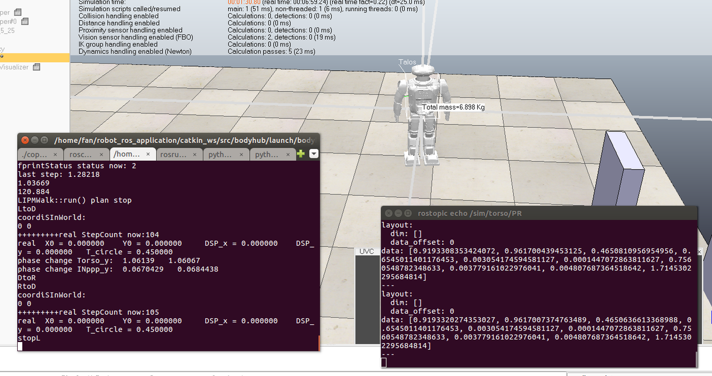

# 键盘控制定点移动



```
执行顺序：

1. Roscore
2. 开vrep
3. 开 sudo bash bodyhub.sh ，开 ik_module
4. 开key_tele.py，需要tele卡死一次即可
5. 开key_cmd.py，调用public里的path_tracking（path_tracking融进key_cmd了）
```

修改目标点，即修改yaml文件。

地板一格是0.5米

把ik_module的动作加进key_cmd