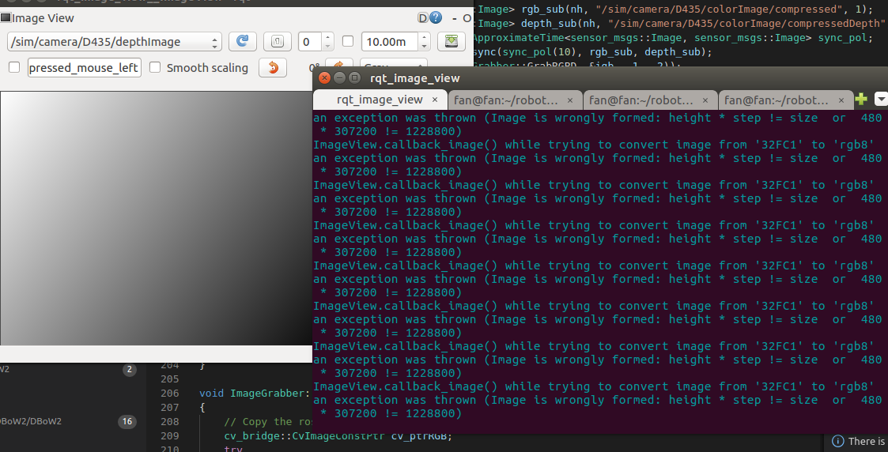
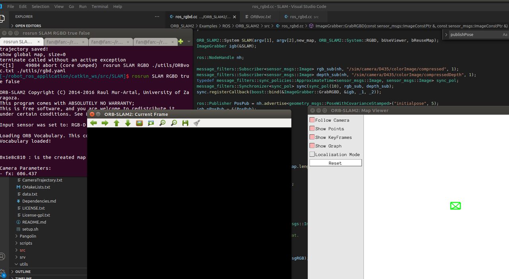

# 问题及解决

## 1.Vrep里发深度图格式为32FC1，ORB-SLAM输入却是16UC1

解决方法：

调用 \2022\normal_sim_game\ai_innovative_roban_sim\scripts\sim_image_convert_slam_form.py

## 2.状态机出现严重的抢占问题

解决办法：每次出现要使用状态机的时候，调用bodyhubreset